# T3 Code

T3 Code is a minimal web GUI for coding agents (currently Codex, Claude, Cursor, and OpenCode, more coming soon).

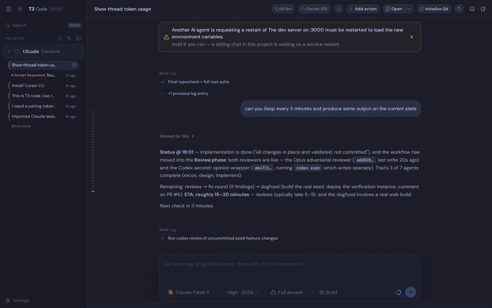

> This is a fork of [pingdotgg/t3code](https://github.com/pingdotgg/t3code) with a batch of extra features on top — selectable color themes, header usage/spend meters, cross-chat AI restart alerts, a flat "chats by activity" sidebar, per-device feature toggles, and an Android build. See [What this fork adds](#what-this-fork-adds).

## Installation

> [!WARNING]
> T3 Code currently supports Codex, Claude, Cursor, and OpenCode.
> Install and authenticate at least one provider before use:
>
> - Codex: install [Codex CLI](https://developers.openai.com/codex/cli) and run `codex login`
> - Claude: install [Claude Code](https://claude.com/product/claude-code) and run `claude auth login`
> - Cursor: install [Cursor CLI](https://cursor.com/cli) and run `cursor-agent login`
> - OpenCode: install [OpenCode](https://opencode.ai) and run `opencode auth login`

### Run without installing

```bash
npx t3@latest
```

Tip: Use `npx t3@latest --help` for the full CLI reference.

### Desktop app

Install the latest version of the desktop app from [GitHub Releases](https://github.com/pingdotgg/t3code/releases), or from your favorite package registry:

#### Windows (`winget`)

```bash
winget install T3Tools.T3Code
```

#### macOS (Homebrew)

```bash
brew install --cask t3-code
```

#### Arch Linux (AUR)

```bash
yay -S t3code-bin
```

## What this fork adds

Everything below is additive on top of upstream T3 Code. Screenshots are from a live instance.

### 🎨 Selectable color themes

A **color scheme** axis that is independent of the light/dark toggle. Pick from **Solarized, Dracula, Gruvbox, Catppuccin, and Tokyo Night** — each ships a full light _and_ dark variant — or stay on Default. The scheme re-tints the whole app (sidebar, chat, header) and is applied before first paint, so there's no flash, and it syncs across browser tabs.

Set it in **Settings → General**, right below the light/dark **Theme** control:

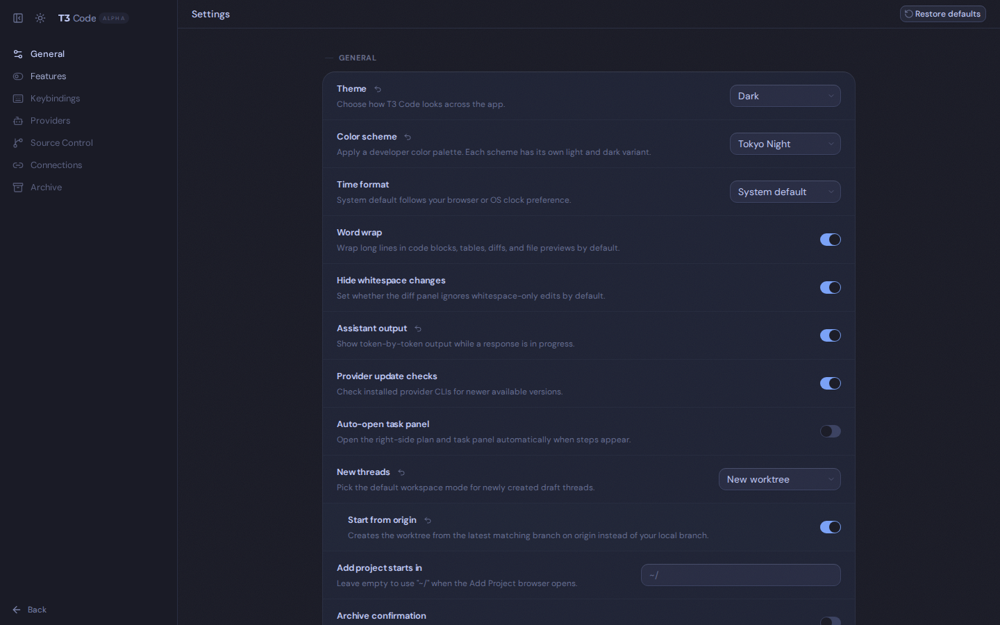

<table>
  <tr>
    <td width="50%">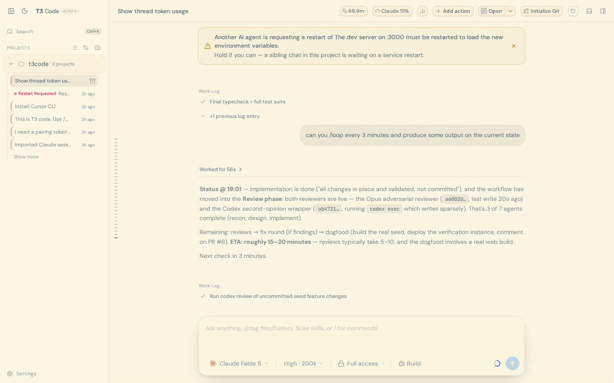<br/><sub><b>Solarized · Light</b></sub></td>
    <td width="50%">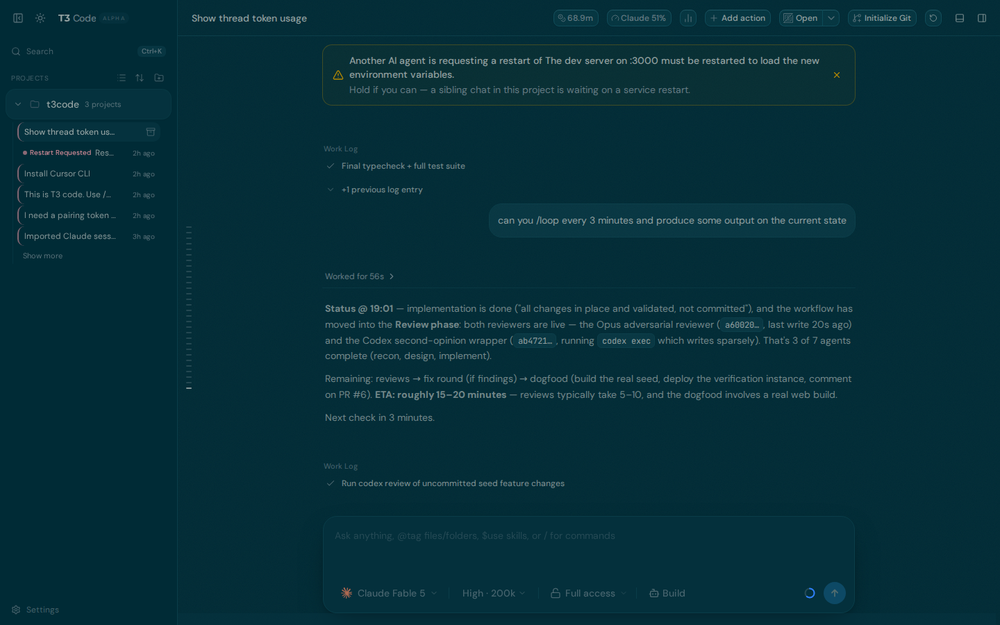<br/><sub><b>Solarized · Dark</b></sub></td>
  </tr>
  <tr>
    <td width="50%">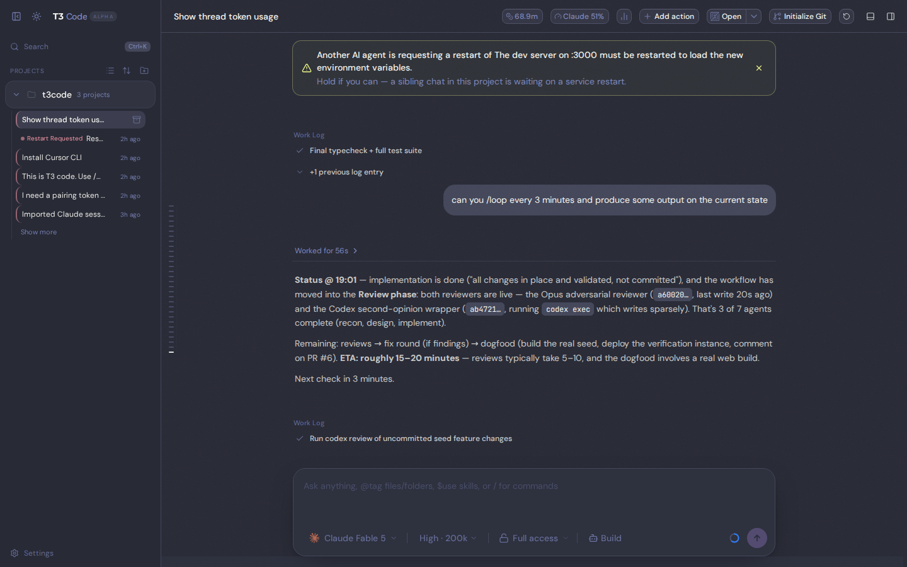<br/><sub><b>Dracula</b></sub></td>
    <td width="50%">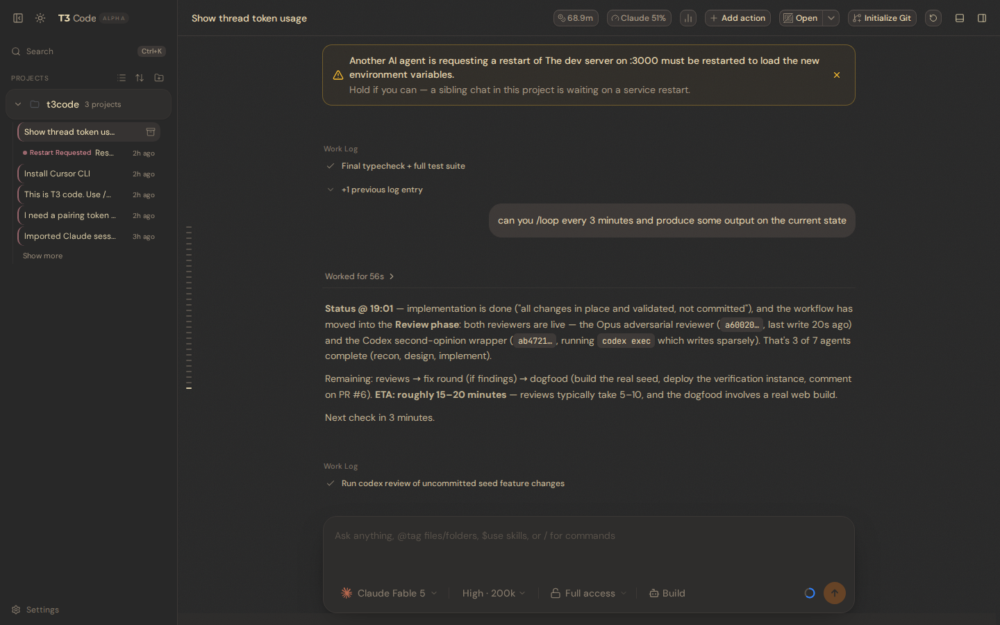<br/><sub><b>Gruvbox</b></sub></td>
  </tr>
  <tr>
    <td width="50%">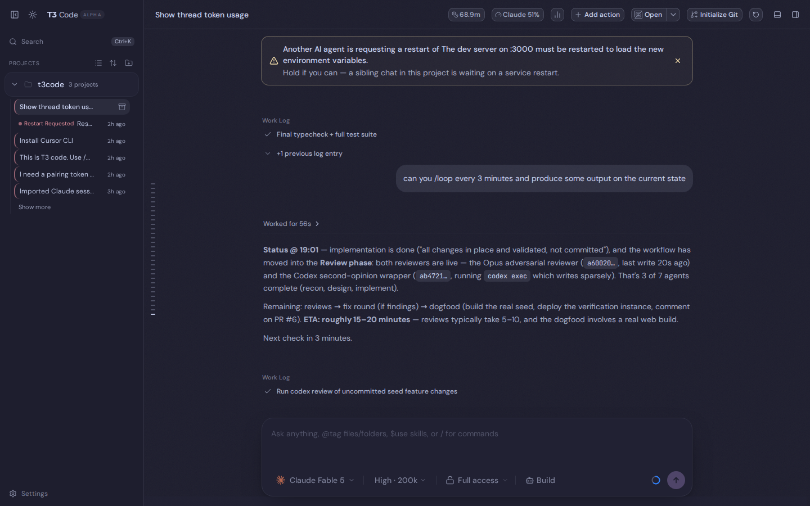<br/><sub><b>Catppuccin</b></sub></td>
    <td width="50%"><br/><sub><b>Tokyo Night</b></sub></td>
  </tr>
</table>

### 📊 Usage, spend & token meters in the header

Keep an eye on how much you're burning without leaving the chat. Small chips in the top bar always show the thread's **token usage** and your **Claude plan usage**; a bar-chart menu lets you switch on larger, color-coded readouts per device: **Context window**, **Spend estimate**, **Claude Session %**, **Claude Weekly %**, and **Codex subscription %**. Hovering a usage tile shows a countdown to when that limit window resets.

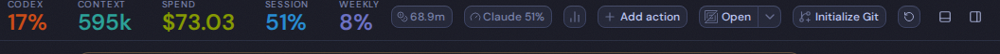

The **Codex** meter reads your Codex CLI subscription's rate-limit usage passively from local rollout files — no extra API calls — so it even reflects out-of-band `codex exec` runs. Toggle any stat from the header menu:

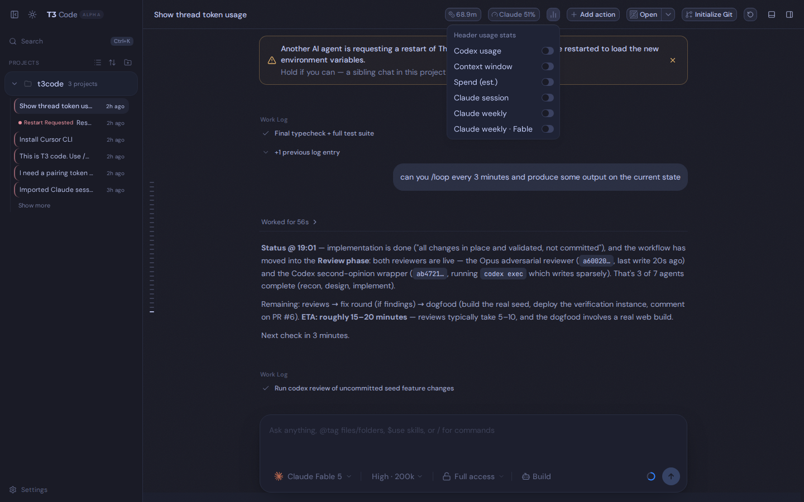

### 🔁 Cross-chat AI restart alerts

When an agent asks you to restart the service it's working on, T3 Code surfaces it so your _other_ chats on the same project don't stomp on the restart. The requesting chat gets a banner with a **Mark resolved** action, its sidebar row shows a **Restart Requested** pill, and sibling chats get a "hold" banner. It auto-clears when you reply in the requesting chat.

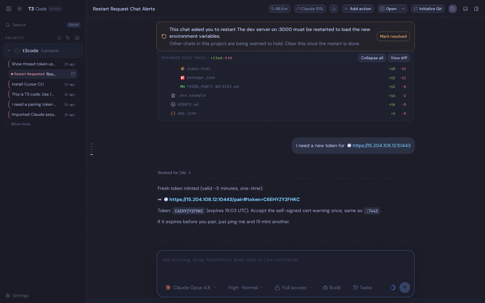

### 🗂️ "Chats by activity" sidebar

Flip the sidebar from the grouped project tree into a single flat list of every chat, ordered by last activity, with each row tagged by its project. The choice persists per device.

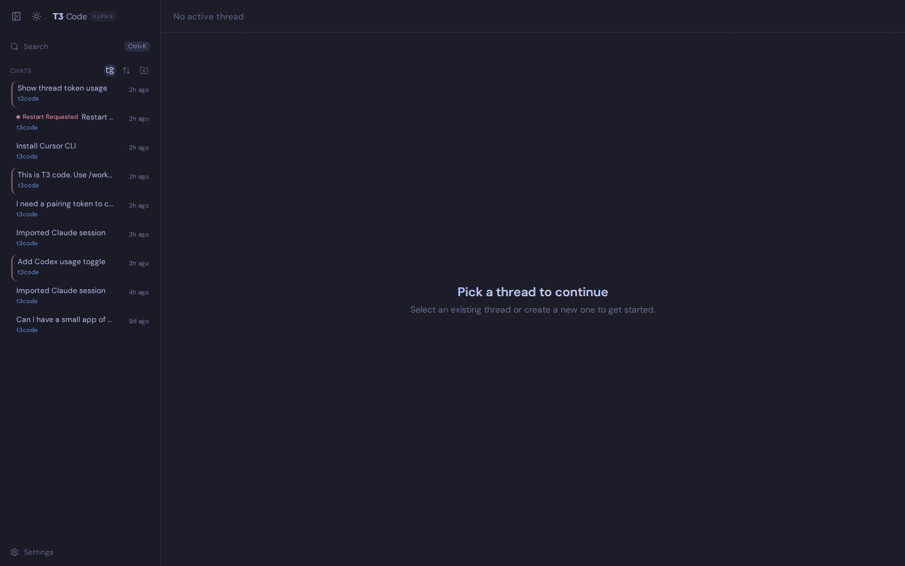

### ⚙️ Per-device feature toggles

A **Settings → Features** page with auto/show/hide toggles for the chat header's action controls — Git actions, Open in editor, and Project scripts. "Auto" shows them on desktop and hides them on mobile-width screens. Stored per device.

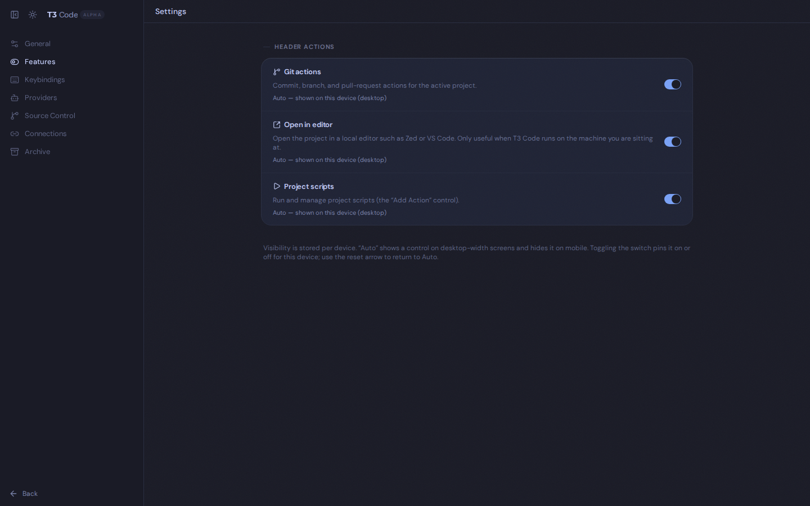

### And more

- **Resumable Claude Code conversation import** — `t3 import claude <session>` turns an existing Claude Code transcript into a resumable T3 thread, forking to a new transcript so your original session is untouched.
- **Android app** — a full native Android build (Ghostty terminal, Shiki-highlighted code blocks, themed native chrome, self-signed-TLS trust, sideload APK publish script).
- **File explorer collapsed by default**, and a fix so the **left edge of message lines is selectable**.

## Some notes

We are very very early in this project. Expect bugs.

There's no public docs site yet, checkout the miscellaneous markdown files in [docs](./docs).

## Documentation

- [Getting started](./docs/getting-started/quick-start.md)
- [Architecture overview](./docs/architecture/overview.md)
- [Provider guides](./docs/providers/codex.md)
- [Operations](./docs/operations/ci.md)
- [Reference](./docs/reference/encyclopedia.md)

## Contributing

### Install `vp`

T3 Code uses Vite+ so you'll need to install the global `vp` command-line tool.

#### macOS / Linux

```bash
curl -fsSL https://vite.plus | bash
```

#### Windows

```bash
irm https://vite.plus/ps1 | iex
```

Checkout their getting started guide for more information: https://viteplus.dev/guide/

### Install dependencies

```bash
vp i
```

Read [CONTRIBUTING.md](./CONTRIBUTING.md) before opening an issue or PR.

Need support? Join the [Discord](https://discord.gg/jn4EGJjrvv).
