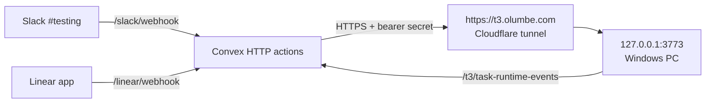

# Linear Agent MVP Local Setup

This is the local-PC setup for testing the Linear/Slack agent path end to end.

## Topology



The worker is this machine. It is not a separate cloud host.

## Required Local Services

```text
t3code-server
  node apps/server/dist/bin.mjs --port 3773 --host 127.0.0.1 --no-browser

t3code-tunnel
  C:\Program Files (x86)\cloudflared\cloudflared.exe tunnel run t3code-local
```

Operator command:

```cmd
scripts\start-t3code-prod.cmd
```

## Required Env

Convex:

```bash
T3_EXECUTION_BRIDGE_BASE_URL=https://t3.olumbe.com
T3_EXECUTION_BRIDGE_SHARED_SECRET=<same secret used by local T3 server>
LINEAR_DEFAULT_WORKSPACE_ROOT=C:\Users\Vivek\Affil\t3code
```

Local T3 server:

```bash
ORCHESTRATOR_BASE_URL=https://<your-convex-site>
T3_EXECUTION_BRIDGE_SHARED_SECRET=<same secret configured in Convex>
T3_DEFAULT_PROVIDER_INSTANCE_ID=claudeAgent
T3_DEFAULT_MODEL=claude-sonnet-4-6
```

Linear app credentials still live in Convex:

```bash
LINEAR_CLIENT_ID=<linear-client-id>
LINEAR_CLIENT_SECRET=<linear-client-secret>
LINEAR_WEBHOOK_SECRET=<linear-webhook-secret>
LINEAR_BOT_USERNAME=<agent display name>
```

Slack credentials and signing secrets also stay in Convex.

## Bridge Routes

Convex expects the local T3 server to expose:

```text
POST /api/tasks/materialize
POST /api/execution/runs
POST /api/execution/runs/continue
POST /api/execution/runs/interrupt
POST /api/execution/runs/status
POST /api/tasks/pull-request/ensure
```

Every bridge route requires:

```http
Authorization: Bearer <T3_EXECUTION_BRIDGE_SHARED_SECRET>
```

T3 callbacks for current task runtime state go to:

```text
POST /t3/task-runtime-events
```

## Verification

```powershell
schtasks /query /tn t3code-server /fo LIST /v
schtasks /query /tn t3code-tunnel /fo LIST /v
curl.exe -i http://127.0.0.1:3773/
curl.exe -i https://t3.olumbe.com/
curl.exe -i -X POST https://t3.olumbe.com/api/execution/runs/status
```

Unauthenticated bridge calls should return `401` after the server build is updated and the local secret is configured.

## Live Smoke Pattern

Slack:

- use `#testing` (`C0AJ5HR70PR`)
- mention `Engineering Agent`
- ask for a tiny dated smoke task
- confirm the agent replies in-thread and Convex/T3 create the runtime task

Linear:

- use a test issue/comment with the configured Linear app
- mention or delegate a tiny dated smoke task
- confirm Convex accepts the webhook, local T3 receives the bridge request, and Linear receives a threaded reply
